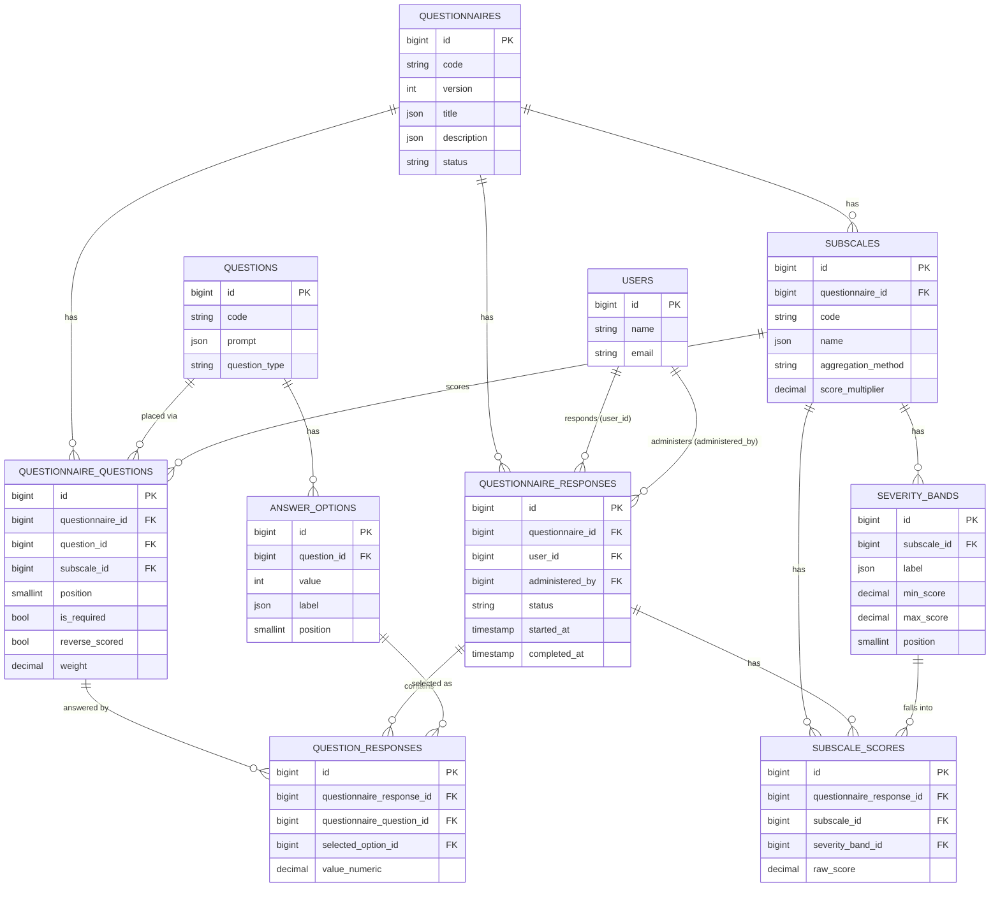

# Questionnaire Feature — Entity Relationship Diagram

```mermaid
erDiagram
    USERS {
        bigint id PK
        string name
        string email
    }
    QUESTIONNAIRES {
        bigint id PK
        string code
        int version
        json title
        json description
        string status
    }
    QUESTIONS {
        bigint id PK
        string code
        json prompt
        string question_type
    }
    ANSWER_OPTIONS {
        bigint id PK
        bigint question_id FK
        int value
        json label
        smallint position
    }
    SUBSCALES {
        bigint id PK
        bigint questionnaire_id FK
        string code
        json name
        string aggregation_method
        decimal score_multiplier
    }
    SEVERITY_BANDS {
        bigint id PK
        bigint subscale_id FK
        json label
        decimal min_score
        decimal max_score
        smallint position
    }
    QUESTIONNAIRE_QUESTIONS {
        bigint id PK
        bigint questionnaire_id FK
        bigint question_id FK
        bigint subscale_id FK
        smallint position
        bool is_required
        bool reverse_scored
        decimal weight
    }
    QUESTIONNAIRE_RESPONSES {
        bigint id PK
        bigint questionnaire_id FK
        bigint user_id FK
        bigint administered_by FK
        string status
        timestamp started_at
        timestamp completed_at
    }
    QUESTION_RESPONSES {
        bigint id PK
        bigint questionnaire_response_id FK
        bigint questionnaire_question_id FK
        bigint selected_option_id FK
        decimal value_numeric
    }
    SUBSCALE_SCORES {
        bigint id PK
        bigint questionnaire_response_id FK
        bigint subscale_id FK
        bigint severity_band_id FK
        decimal raw_score
    }

    QUESTIONNAIRES ||--o{ SUBSCALES : "has"
    QUESTIONNAIRES ||--o{ QUESTIONNAIRE_QUESTIONS : "has"
    QUESTIONNAIRES ||--o{ QUESTIONNAIRE_RESPONSES : "has"

    QUESTIONS ||--o{ ANSWER_OPTIONS : "has"
    QUESTIONS ||--o{ QUESTIONNAIRE_QUESTIONS : "placed via"

    SUBSCALES ||--o{ SEVERITY_BANDS : "has"
    SUBSCALES ||--o{ QUESTIONNAIRE_QUESTIONS : "scores"
    SUBSCALES ||--o{ SUBSCALE_SCORES : "has"

    QUESTIONNAIRE_QUESTIONS ||--o{ QUESTION_RESPONSES : "answered by"

    QUESTIONNAIRE_RESPONSES ||--o{ QUESTION_RESPONSES : "contains"
    QUESTIONNAIRE_RESPONSES ||--o{ SUBSCALE_SCORES : "has"

    ANSWER_OPTIONS ||--o{ QUESTION_RESPONSES : "selected as"
    SEVERITY_BANDS ||--o{ SUBSCALE_SCORES : "falls into"

    USERS ||--o{ QUESTIONNAIRE_RESPONSES : "responds (user_id)"
    USERS ||--o{ QUESTIONNAIRE_RESPONSES : "administers (administered_by)"
```
